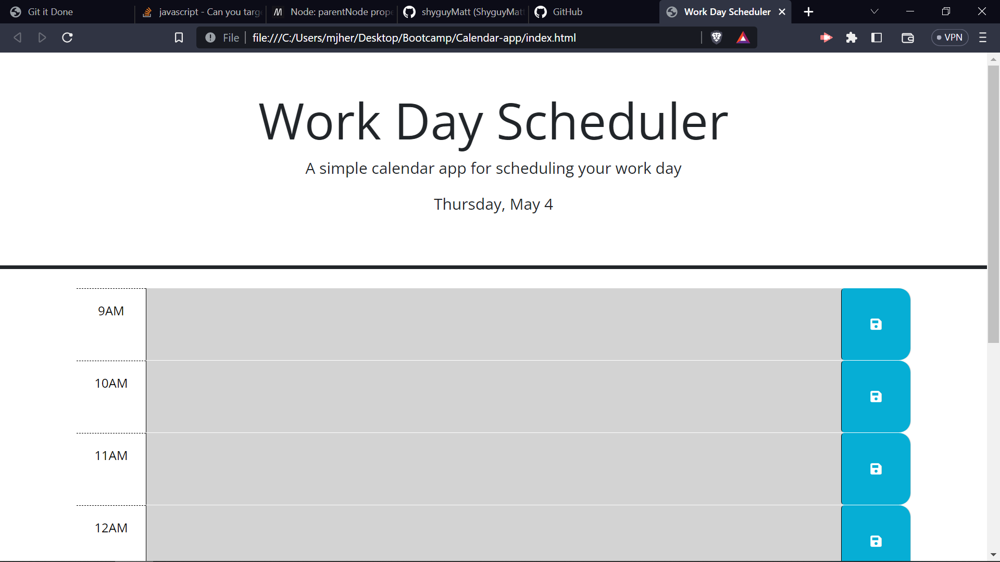
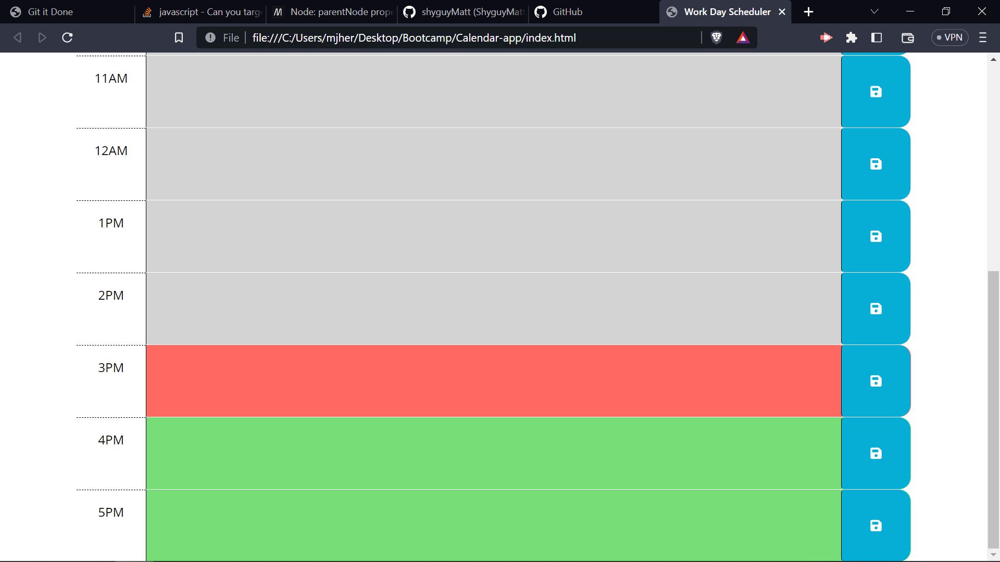

# 05 Third-Party APIs: Work Day Scheduler

## Objective

our objective is to add functionality to a calendar website,
the website needs to have the date at the top
and the time blocks need to be color coded based on the time of day

we need to be able to save tasks written on the time blocks to localStorage
and those tasks need to be automatically loaded when the page is loaded

## ScreenShots

## Links
Github Repo
https://github.com/shyguyMatt/Calendar-app

Github Pages
https://shyguymatt.github.io/Calendar-app

